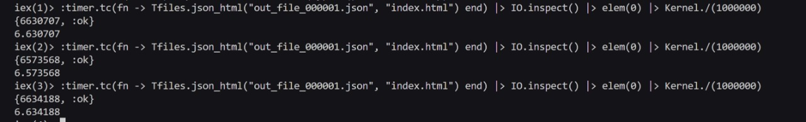
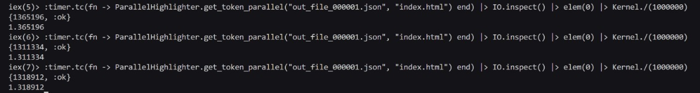

<b> Integrantes del Equipo: </b> 
Andreína Sanánez, A01024927  
Ana Paula Katsuda, A01025303  

# Actividad Integradora 2 - Resaltador de Sintaxis Paralelo

## Instrucciones de uso del Programa
Para utilizar el código anterior, en el mismo directorio se deben de contar principalmente con los siguientes archivos:
- main2.exs
- index.html
- token_colors.css
- out_file_000001.json
- out_file_000002.json
- out_file_000003.json
- out_file_000004.json
- out_file_000005.json
- out_file_000006.json
- out_file_000007.json

Para correr el programa de forma correcta, ejecute el siguiente comando en su terminal estando en dicho directorio.
_> iex main2.exs_

Una vez estando en el modo interactivo de Elixir, ejecute la siguiente línea para correr la función que realiza el resaltado de sintaxis de numerosos archivos utilizando concurrencia.

	>ParallelHighlighter.parallel_regex(["out_file_000001.json", "out_file_000002.json", "out_file_000003.json"])
Finalmente,  para visualizar el resaltado de la sintaxis abra los diversos archivos _“index{num}.html”_ generados por cada json en su buscador de preferencia.

## Análisis de la solución
En el presente reporte se describe y analiza a profundidad la solución implementada para la realización de un resaltador de sintaxis paralelo mediante el lenguaje de programación funcional Elixir así como el uso de expresiones regulares. Adicionalmente, es relevante mencionar que dicho resaltador evalúa la sintaxis del formato de texto JSON (JavaScript Object Notation) y muestra las misma mediante un documento HTML. Específicamente, la solución planteada para el resaltador de sintaxis toma en consideración los siguientes elementos:
- _Dígitos_: se resaltan números enteros, flotantes y exponenciales.
- _Cadena de caracteres (strings)_: se resaltan las cadenas de caracteres encapsuladas entre comillas correspondientemente. 
- _Objetos_: se resalta el nombre del par el cual se encuentra encapsulado entre comillas y seguido de dos puntos.
- _Puntuación_: se resaltan signos de puntuación como corchetes, llaves,  comas, dos puntos.
- _Palabras reservadas_: se resaltan palabras reservadas como true, false, null.
	
Es relevante recalcar, que al ser paralelo, es posible hacer el mencionado análisis de sintaxis para distintos archivos al mismo tiempo. El presente código, consta de tres procesos principales traducidos en las siguientes funciones: 
- _get_token_parallel_: esta función lee un archivo a manera de “stream”, aplica el reconocimiento de expresiones regulares para cada línea (dado el “stream”) y lo convierte en un “string” que se inserta en el html correspondiente. 
- _regex_: esta función se encarga de hacer las evaluaciones de expresiones regulares y agregar el contenido en formato html de manera recursiva para cada expresión encontrada. 
- _parallel_regex_: esta función se usa para hacer el proceso de resaltar sintaxis de manera paralela utilizando el mismo número de “threads” que corresponden al tamaño de la lista de archivos seleccionada.

## Análisis de tiempos
En cuanto a los tiempos de “speedup”, resulta conveniente explicar que anteriormente se tenía un código altamente ineficiente. Lo anterior no solo fue evidente al tener una complejidad temporal de casi n3 y notar que el código tardaba mucho en arrojar resultados, sino que al analizar la lógica detrás existían muchas áreas de oportunidad. En primer lugar, al utilizar la función “replace()” se estaba modificando directamente el archivo original y las evaluaciones de expresiones regulares se volvían más complejas al agregar notación de “html”. Además, el “string” con el que se estaba trabajando, cada vez se volvía más largo, dificultando cada vez más el proceso que se requería en el código. 

A continuación se nota el tiempo para la lectura de un archivo utilizando el algoritmo planteado inicialmente: 

Dada la gran ineficiencia que resultaba del algoritmo utilizado anteriormente, se decidió realizar una versión mejorada en la que la función principal encargada de generar el archivo de html correspondiente, ahora comenzará por recibir dos listas; una con la línea actual a la cual se le aplicarían las expresiones regulares, y otra que guardara el resultado de los tags de html correspondientes al inicio de la lista que finalmente será invertida. Ahora bien, a esta línea actual conforme cada iteración recursiva se elimina la sección analizada así haciendo cada vez más pequeño lo que resta por analizar. 
Con la explicación anterior es posible notar dos mejoras principales, siendo la primera de ellas la eficiencia que radica de la misma al ir eliminado en cada iteración la línea a la que se le aplican las expresiones regulares. De esta manera, la línea analizada no solo va disminuyendo en tamaño, sino que evita los problemas que se tenían en el algoritmo anterior ocasionadas por aplicar las expresiones regulares a una misma línea más de una sola vez. 
Esto conduce a la segunda mejora, que impacta enormemente el mantenimiento a futuro del código. Esto ya que ahora donde las líneas de html resultantes se almacenan en una lista por separado, en lugar de reemplazar el mismo archivo que se estaba constantemente trabajando, permite que las expresiones regulares sean significativamente más sencillas y por ende más fáciles de modificar o mantener conforme el paso del tiempo.
De forma similar, en la siguiente imagen se muestran los tiempos obtenidos a partir de la ejecución de esta implementación del código mejorada, en la cual es posible observar la gran reducción de tiempo que se logró a comparación de la primera versión.

Utilizando la versión mejorada descrita anteriormente, fue posible añadir un algoritmo para la lectura y evaluación de archivos “json” en paralelo. En este caso, se determinó que la cantidad de “threads” a utilizar, sería igual a la cantidad de archivos a leer de manera que paralelamente se procese cada archivo. 
	
Teniendo lo anterior en mente, es posible observar en la siguiente imagen, el “speedup” resultante de leer tres archivos paralelamente: 

De lo mostrado previamente, es posible notar que el tiempo al eficientizar el algoritmo tiene un cambio significativo (de aproximadamente 6 segundos a prácticamente 1 segundo). Además, en el resaltador no paralelo, es posible notar diferencias mínimas en los tiempos en los que procesa un mismo archivo. Entrando en la implementación paralela, es interesante observar que si bien es más tardado que la lectura de un solo archivo, la diferencia de tiempos no es tan radical. Considerando que se están leyendo tres archivos en lugar de uno, se vuelve evidente el efecto que tiene aprovechar los núcleos de los CPU en cuanto a eficiencia temporal; leer los tres archivos por separado, habría implicado por lo menos alrededor de 3 segundos, mientras que en este caso, tenemos casi la mitad de esa cantidad de tiempo. 